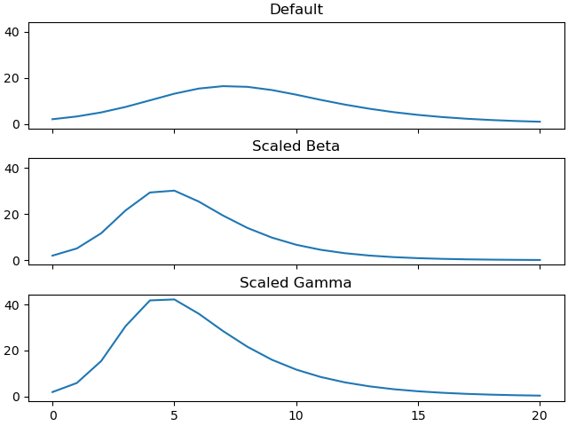
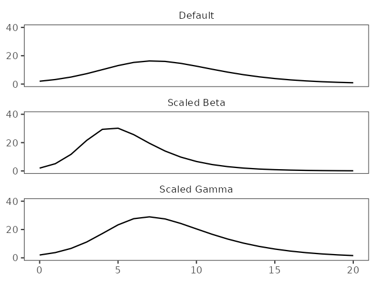

# Example: Python vs R

=== "Overview"

    Here we have provided SIR ODE model implementations in Python and in R.
    Each script runs several scenarios and produces a plot of infection prevalence for each scenario.

    You can download each script to debug on your computer:

    - [sir_ode.py](sir_ode.py)
    - [sir_ode.R](sir_ode.R)

=== "Python"

    ```py title="sir_ode.py" linenums="1"
    --8<-- "sir_ode.py"
    ```

=== "R"

    ```R title="sir_ode.R" linenums="1"
    --8<-- "sir_ode.R"
    ```

??? bug "The model outputs differ!"

    Here are prevalence time-series plots produced by each script:

    === "Python plot"

        <figure markdown="span">
          
          <figcaption>Model outputs for the Python script.</figcaption>
        </figure>

    === "R plot"

        <figure markdown="span">
          
          <figcaption>Model outputs for the R script.</figcaption>
        </figure>

??? note "Some initial thoughts ..."

    - Is it obvious whether one of the figures is correct and the other is wrong?

    - The `sir_rhs()` functions in the two scripts appear to be equivalent — but are they?

    - The `default_settings()` functions appear to be equivalent — but are they?

    - The `run_model_scaled_beta()` and `run_model_scaled_gamma()` functions also appear to be equivalent.

    - Where might you begin looking?

??? info "Commentary"

    > I've heard that dicts (and other mutable data types) are passed by reference, as such a function could change the “local” value of a variable, which causes an error when using the “global” variable in another function.
    >
    > This would also be good for showing that your test cases aren’t perfect.
    >
    > You can run function 1 tests and get good answers, and then run function 2 test and get good answers, but this is because they are not sharing the state of the mutable variable.
    > Sounds like a great inclusion as a mini chapter.

    These are great ideas! The one drawback of the mutable data example is that it won't work in R, because it's copy-on-write. But that's no big deal. In fact, now that I think about, this difference us surely worth highlighting! People who are familiar with only one of these two languages need to be aware of this important difference if they begin using the other language.

    I've come up with an example of shared mutable state resulting in incorrect model outputs.

    !!! quote "The R Language Definition"

        The semantics of invoking a function in R argument are **call-by-value**.
        In general, supplied arguments behave as if they are **local variables** initialized with the value supplied and the name of the corresponding formal argument.
        Changing the value of a supplied argument within a function **will not affect** the value of the variable in the calling frame.

        — [Argument Evaluation](https://cran.r-project.org/doc/manuals/r-patched/R-lang.html#Argument-evaluation)

    !!! quote "Python Programming FAQ"

        Remember that arguments are **passed by assignment** in Python.
        Since assignment just **creates references** to objects, there's no alias between an argument name in the caller and callee, and so no call-by-reference per se.

        — [How do I write a function with output parameters (call by reference)?](https://docs.python.org/3/faq/programming.html#how-do-i-write-a-function-with-output-parameters-call-by-reference)

    ??? info "Output messages"

        Here are the output messages printed by each script:

        === "Python"

            ```text
            beta = 1.0  gamma = 0.5
            beta = 1.5  gamma = 0.5
            beta = 1.5  gamma = 0.35
            ```

        === "R"

            ```text
            beta = 1.0  gamma = 0.5
            beta = 1.5  gamma = 0.5
            beta = 1.0  gamma = 0.35
            ```

    ??? bug "Parameters differ!"

        There's a difference in the parameter values for the third scenario:

        ```diff
          beta = 1.0  gamma = 0.5
          beta = 1.5  gamma = 0.5
        - beta = 1.5  gamma = 0.35
        + beta = 1.0  gamma = 0.35
        ```
