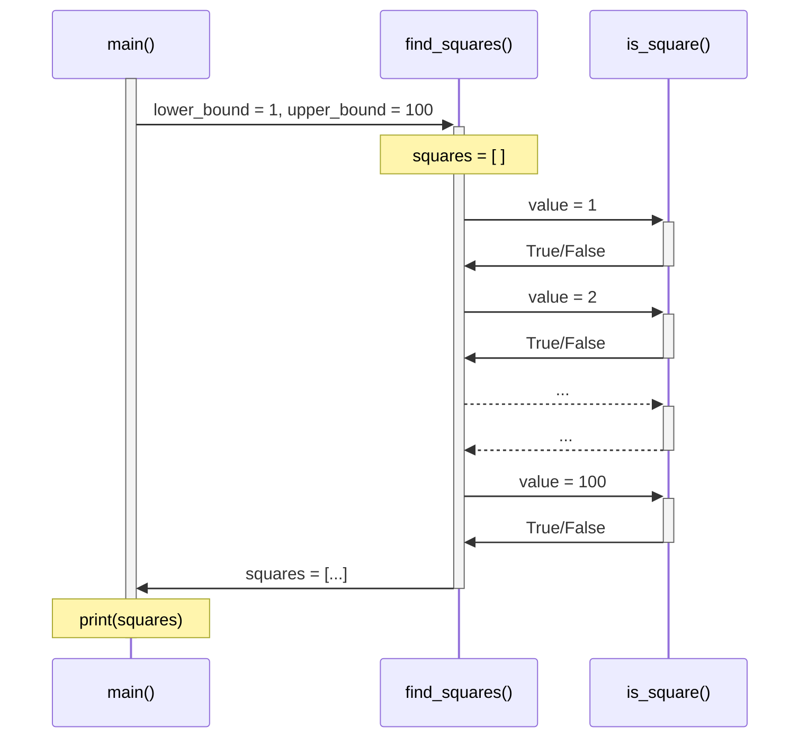

# Example: Square numbers

[Square numbers](https://en.wikipedia.org/wiki/Square_number) are positive integers that are equal to the square of an integer.
Here we have provided example Python and R scripts that print all of the square numbers between 1 and 100:

<div id="square-numbers-demo" data-cast-file="../square-numbers-demo.cast"></div>

You can download these scripts to run on your own computer:

- [square_numbers.py](square_numbers.py)
- [square_numbers.R](square_numbers.R)

Each script contains three functions:

- `main()`
- `find_squares(lower_bound, upper_bound)`
- `is_square(value)`

The diagram below shows how `main()` calls `find_squares()`, which in turn calls `is_square()` many times.



??? info "Source code"

    === "Python"

        ```py title="square_numbers.py" linenums="1"
        --8<-- "square_numbers.py"
        ```

    === "R"

        ```R title="square_numbers.R" linenums="1"
        --8<-- "square_numbers.R"
        ```

## Stepping through the code

These recorded terminal sessions demonstrate how to use Python and R debuggers from the command line.
They cover:

- How to define breakpoints;
- How to inspect the current values of variables; and
- How to step through, and over, lines of code.

!!! info "Manual breakpoints"

    You can also create breakpoints in your code by calling [`breakpoint()`](https://docs.python.org/3/library/pdb.html) for Python, and [`browser()`](https://adv-r.hadley.nz/debugging.html#browser) for R.

!!! tip "Interactive debugger sessions"

    If your editor supports running a debugger, **use this feature!**
    See these examples for [RStudio](https://support.posit.co/hc/en-us/articles/205612627-Debugging-with-the-RStudio-IDE), [PyCharm](https://www.jetbrains.com/pycharm/features/debugger.html), [Spyder](https://docs.spyder-ide.org/current/panes/debugging.html), and [VS Code](https://code.visualstudio.com/docs/editor/debugging).

=== "Python debugger"

    <div id="pdb-demo" data-cast-file="../square-numbers-pdb.cast"></div>

    Video timeline:

    1. <a data-video="pdb-demo" data-seek-to="4.7" href="javascript:;">Set a breakpoint</a>
    2. <a data-video="pdb-demo" data-seek-to="9.081" href="javascript:;">Show current location</a>
    3. <a data-video="pdb-demo" data-seek-to="16.146" href="javascript:;">Step into `is_square()`</a>
    4. <a data-video="pdb-demo" data-seek-to="36.744" href="javascript:;">Return from `is_square()`</a>
    5. <a data-video="pdb-demo" data-seek-to="40.021" href="javascript:;">Show updated `squares` list</a>
    6. <a data-video="pdb-demo" data-seek-to="57.947" href="javascript:;">Add a conditional breakpoint</a>
    7. <a data-video="pdb-demo" data-seek-to="69.697" href="javascript:;">Stop at the conditional breakpoint</a>
    8. <a data-video="pdb-demo" data-seek-to="76.202" href="javascript:;">Continue until the script ends</a>

=== "R debugger"

    <div id="r-debug-demo" data-cast-file="../square-numbers-r-debug.cast"></div>

    Video timeline:

    1. <a data-video="r-debug-demo" data-seek-to="6.568" href="javascript:;">Set a breakpoint</a>
    2. <a data-video="r-debug-demo" data-seek-to="23.548" href="javascript:;">Step into `is_square()`</a>
    3. <a data-video="r-debug-demo" data-seek-to="29.654" href="javascript:;">Return from `is_square()`</a>
    4. <a data-video="r-debug-demo" data-seek-to="33.505" href="javascript:;">Show updated `squares` list</a>
    5. <a data-video="r-debug-demo" data-seek-to="47.751" href="javascript:;">Add a conditional breakpoint</a>
    6. <a data-video="r-debug-demo" data-seek-to="67.77" href="javascript:;">Stop at the conditional breakpoint</a>
    7. <a data-video="r-debug-demo" data-seek-to="74.546" href="javascript:;">Continue until the script ends</a>
