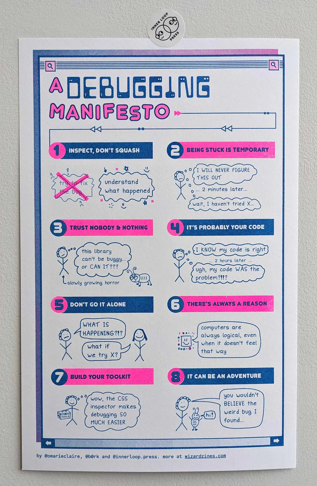

# Debugging manifesto

<figure markdown="span">
  { align=left, width="50%" }
  <figcaption markdown="span">
  [Julia Evans](https://jvns.ca/) and [Tanya Brassie](https://tanyabrassie.com/): [Debugging Manifesto Poster](https://store.wizardzines.com/products/poster-debugging-manifesto), 2024.
  </figcaption>
</figure>

!!! info

    See the [Resources](resourced.md) page for links to more of Julia Evans' articles, stories, and zines about debugging.
